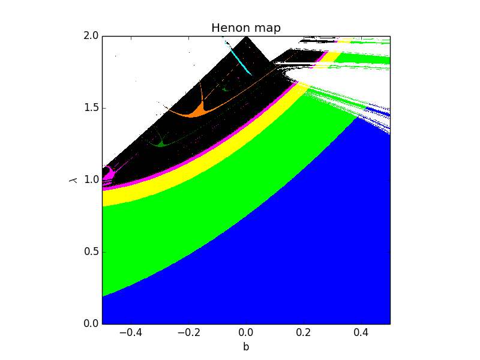

# Fizibilite Raporu: Henon Haritası Analizi

## Giriş

Bu fizibilite raporu, Henon Haritası'nı kullanarak dinamik sistemlerin kaotik davranışlarını ve dönüşümlerini incelemeyi amaçlamaktadır. Henon Haritası, karmaşık ve kaotik davranışlar sergileyen bir iki boyutlu haritadır ve özellikle popülasyon dinamikleri ve kriptografi gibi alanlarda kullanılmaktadır.

## Amaç ve Hedefler

Bu analizin ana hedefleri şunlardır:

1. Sistemdeki belirli parametrelerin değişimiyle ilgili olarak sistemin davranışında meydana gelen dönüşümleri belirlemek.
2. Kaotik davranışların belirlenmesi ve sistemdeki karmaşıklığı analiz etmek.
3. Sistemdeki belirli parametrelerin değerlerinin, sistem davranışı üzerindeki etkilerini anlamak.
4. Analiz sonuçlarına dayanarak kararlar almak ve sistem performansını iyileştirmek için öneriler sunmak.

## Henon Haritası Analizi Yöntemi

Henon Haritası Analizi için izlenecek adımlar şunlardır:

1. Sistem denklemlerinin tanımlanması ve belirli bir değişkenin seçilmesi.
2. Belirli bir parametre aralığında sistem davranışının incelenmesi.
3. Her parametre değeri için sistem davranışının görselleştirilmesi ve Henon Haritası'nın oluşturulması.
4. Diyagram üzerinde belirli desenlerin, dönüşümlerin veya kaotik davranışların analizi.
- Örnek Bir Henon Map:

## Analiz Adımları ve Teknikler

Henon Haritası Analizi adımları şu şekildedir:

1. Sistem denklemlerinin tanımlanması: Henon Haritası için kullanılacak diferansiyel denklemlerin tanımlanması ve analiz edilecek değişkenlerin belirlenmesi.
2. Parametre aralığının belirlenmesi: Analiz için belirli bir parametre aralığının seçilmesi ve bu aralıkta parametre değerlerinin değiştirilmesi.
3. Harita oluşturma: Her parametre değeri için Henon Haritası'nın oluşturulması ve sistem davranışının görsel olarak temsil edilmesi.
4. Analiz ve yorumlama: Elde edilen Harita üzerinde belirli desenlerin, dönüşümlerin veya kaotik davranışların analiz edilmesi ve sonuçların yorumlanması.

## Sonuçlar ve Değerlendirme

Henon Haritası Analizi sonuçlarına dayanarak şu değerlendirmeler yapılabilir:

- Belirli parametre değerlerinde sistem davranışında meydana gelen dönüşümler ve desenler belirlenebilir.
- Grafik üzerindeki yapılar, sistemdeki karmaşıklığı ve kaotik davranışları yansıtabilir.
- Belirli parametre değerlerinin sistem davranışı üzerindeki etkileri anlaşılabilir.

## Öneriler ve Sonuç

Henon Haritası Analizi, sistem davranışındaki dönüşümleri ve kaotik davranışları belirlemek için etkili bir yöntemdir. Ancak, analiz sonuçlarının doğru yorumlanması ve sistem özelliklerinin anlaşılması önemlidir.

Öneriler:

1. Eğitim ve Uygulama: Kullanıcıların analiz sürecini daha iyi anlaması ve doğru şekilde uygulaması için eğitim programları düzenlenmelidir.
2. Yazılım ve Arayüz Geliştirmeleri: Analiz için kullanılan yazılımların kullanımı daha kolay ve erişilebilir hale getirilmelidir.
3. Veri Kalitesi ve Doğruluk: Analiz için gereken verilerin doğruluğu ve kalitesi sağlanmalı, eksik veya yanlış verilerin analize etkisi minimize edilmelidir.
   
## SWOT
Güçlü Yönler:
1. Analiz Kesinliği: Henon Haritası Analizi, sistemin belirli parametrelerdeki davranışlarını kesin bir şekilde belirleyebilir, böylece analiz sonuçları güvenilir olabilir.
2. Görselleştirme Yeteneği: Harita oluşturma ve desenleri görsel olarak temsil etme, karmaşık sistem davranışlarını anlamayı kolaylaştırır.
3. Karmaşıklık Analizi: Analiz, sistemdeki karmaşıklığı ve kaotik davranışları anlamak için etkili bir yöntemdir.
4. Karar Destek Aracı: Analiz sonuçlarına dayanarak kararlar almak ve sistem performansını iyileştirmek için önemli bir araç sağlar.

Zayıf Yönler:
1. Eğitim ve Yetenek Gereksinimi: Analizin doğru bir şekilde uygulanması için kullanıcıların belirli bir eğitim ve yetenek seviyesine sahip olmaları gerekebilir.
2. Yazılım ve Teknoloji Bağımlılığı: Analiz için gerekli yazılım ve teknolojiye erişim, bazı kullanıcılar için bir zorluk olabilir.
3. Veri Hassasiyeti: Analiz için gereken verilerin doğruluğu ve kalitesi sağlanmadığı takdirde sonuçlar yanıltıcı olabilir.

Fırsatlar:
1. Endüstriyel Uygulamalar: Henon Haritası Analizi, popülasyon dinamikleri, finansal piyasalar ve kriptografi gibi çeşitli endüstrilerde geniş uygulama potansiyeline sahiptir.
2. Yeni Teknolojilerle Entegrasyon: Analiz, yapay zeka ve makine öğrenimi gibi yeni teknolojilerle entegre edilerek daha gelişmiş sonuçlar elde edebilir.

Tehditler:
1. Rakip Analiz Yöntemleri: Diğer analiz yöntemleri ve modelleri, Henon Haritası Analizi ile rekabet edebilir ve tercih edilebilir.
2. Teknolojik Zorluklar: Analizin tam olarak uygulanması için gereken teknoloji ve altyapı, hızla değişen bir ortamda güncel kalmayı gerektirebilir.

## Sonuç

Resimdeki renkler dönemleri belirtmektedir,
siyah alan kaosa karşılık gelir, beyaz ise iterasyonların dağılımını ifade eder.

