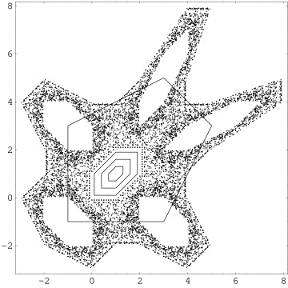
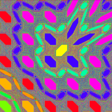

### Gingerbreadman Map Analizi - Barış Yesari 200541013

### Giriş
Gingerbreadman metodu, karmaşıklık teorisinde ve dinamik sistemlerde kullanılan bir matematiksel modeldir. Basit matematiksel denklemlerle tanımlanan bu metod, kaotik davranışları gösteren bir sistem olarak kabul edilir.

Bu metod genellikle şu denklemlerle ifade edilir:
  Xn+1 = 1 - Yn - |Xn|
  Yn+1 = Xn
Bu denklemlerde xn ve yn haritanın bir noktasının koordinatlarını temsil ederken, xn+1 ve yn+1 ise bir sonraki iterasyonda bu noktanın koordinatlarını belirler.

Gingerbreadman metodu, bir çift sayıdan oluşan bir koordinat sistemine sahip olan ve her bir adımda bu koordinatların nasıl değiştiğini gösteren bir grafik olarak düşünülebilir. Bu metod, bir noktanın koordinatlarını aldığında, bu noktanın bir sonraki adımda nasıl bir konumda olacağını belirlemek için kullanılır.

Gingerbreadman metodu, kaotik sistemlerdeki davranışları görselleştirmek ve anlamak için kullanılır. Özellikle, metod üzerinde yapılan analizler şunları sağlayabilir:
1.	Başlangıç Koşullarına Duyarlılık: Bu metoddaki birkaç küçük değişiklik, sonuçta büyük ve belirsiz değişikliklere yol açabilir. Bu, kaotik sistemlerin hassas başlangıç koşullarına sahip olduğunu gösterir.
2.	Belirli Desenlerin Oluşumu: Bu metod üzerinde belirli iterasyonlar yapıldığında, belirli desenlerin nasıl oluştuğu ve nasıl değiştiği gözlemlenebilir. Bu, kaotik sistemlerin karmaşıklığını anlamamıza yardımcı olur.
3.	Sistemin Davranışının Genel Anlayışı: Bu metod üzerinde yapılan analizler, bir kaotik sistemin nasıl davrandığı hakkında genel bir anlayış sağlayabilir. Örneğin, sistemin hangi koşullarda düzenli ve tahmin edilebilir olduğunu veya hangi koşullarda rastgele ve karmaşık olduğunu gösterebilir.

Gingerbreadman metodu, karmaşıklık teorisi ve kaotik sistemlerin matematiksel analizinde önemli bir araç olarak kullanılır. Analizler, sistemlerin doğasını daha iyi anlamamıza ve belirli koşullar altında nasıl davrandıklarını öngörmemize yardımcı olabilir.

  

Harita yukarıdaki dolu bölgede kaotik, altıgen bölgede ise kararlıdır. (0, 0), (1, 0), (2, 1), (2, 2), (1, 2) ve (0, 1) köşeleri tarafından tanımlanan iç altıgendeki her noktanın periyodu altı olan bir yörüngesi vardır (periyodu 1 olan (1, 1) noktası hariç). Diğer beş altıgen bölgedeki yörüngeler birinden diğerine dolanır. Periyodu beş olan tek bir yörünge vardır ve diğerlerinin periyodu 30'dur. Beş periyotlu yörüngelere sahip noktalar yukarıdaki şekilde siyah çizgi ile gösterilen (-1, 3), (-1, -1), (3, -1), (5, 3) ve (3, 5)'tir. Ancak, keyfi olarak uzun bir periyoda sahip sonsuz sayıda farklı periyodik yörünge vardır.

### Gingerbreadman Metodunun Görselleştirilmesi

Gingerbreadman metodu, genellikle bir kare veya dikdörtgen bölge üzerinde renklendirilmiş olarak görselleştirilir. Her bir renk, bir noktanın zamanla hangi bölgeye yakınsadığını gösterir.

   

Gingerbreadman metodunun dinamik özellikleri, aşağıdaki gibidir:  
-	Sabit Noktalar: Haritanın üç sabit noktası vardır: (0,0), (1,0) ve (0,1).
-	Periyodik Döngüler: Haritanın, bir noktaya tekrar tekrar dönen periyodik döngüleri vardır.
-	Kaotik Bölgeler: Haritanın kaotik bölgeleri vardır, burada noktaların davranışı rastgele ve öngörülemezdir.

### Gingerbreadman Metodunun Uygulamaları
-	Kriptografi: Karmaşık ve kaotik davranışı nedeniyle, Zencefil Adam Haritası, kriptografik sistemlerde veri şifrelemek için kullanılabilir.
-	Bilgisayar grafikleri: Haritanın kaotik davranışı, bilgisayar grafiklerinde rastgele desenler ve dokular oluşturmak için kullanılabilir.
-	Robotik: Haritanın kaotik davranışı, robotların karmaşık ortamlarda gezinmesini planlamak için kullanılabilir.
-	Ekonomi: Haritanın kaotik davranışı, finansal piyasaların davranışını modellemek için kullanılabilir.

### Sonuç
Gingerbreadman metodu, basit bir matematiksel formüle sahip olmasına rağmen, karmaşık ve kaotik davranışlar sergileyen bir haritadır. Bu metod, kriptografi, bilgisayar grafikleri, robotik, ekonomi ve biyoloji gibi çeşitli alanlarda uygulamalara sahiptir.

Gingerbreadman metodu hassas başlangıç koşullarına sahip olduğunu ve belirli desenlerin nasıl oluştuğunu göstermektedir. Bu analizler, metodun karmaşıklık teorisi ve kaotik sistemlerin incelenmesinde önemli bir araç olduğunu göstermektedir. Sonuç olarak, Gingerbreadman metodu karmaşıklık teorisi ve kaotik sistemlerin incelenmesinde önemli bir modeldir. Bu çalışma, metodun kaotik doğasını anlamamıza ve karmaşıklık teorisine yeni perspektifler kazandırmamıza yardımcı olabilir.

